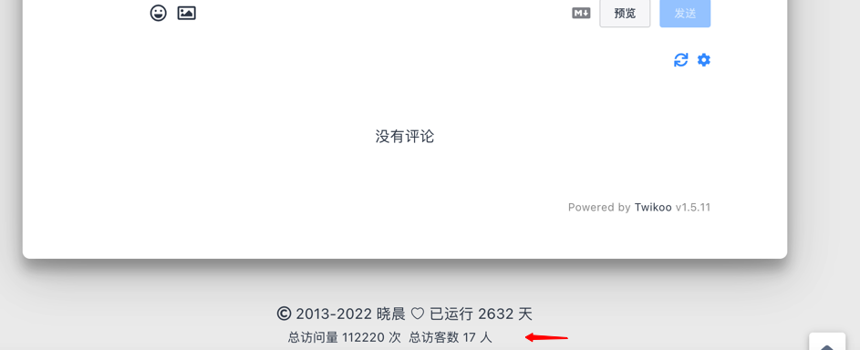

# Hexo Statistics

English|[中文](README_zh-CN.md)

Hexo blog traffic statistics service, based on redis. Use hyperloglog to count UV.

Demo: https://xcmaster.com/

Article pv:


Site uv and pv:




## Get Start

### Step

- 1.Install redis and run in standalone mode
- 2.Run hexo-statistics
- 3.Configure your hexo template

### Install Redis

Ubuntu: `apt-get install redis-server`

#### Docker

````shell
mkdir -p /data/redis

docker run -p 6379:6379 \
  -v /data/redis/conf/redis.conf:/etc/redis/redis.conf \
  -v /data/redis/data:/data \
  --name hexo-stat-redis \
  -d redis:5.0 redis-server /etc/redis/redis.conf
````

### Run hexo-statistics

#### Binary

````shell

export hexo_version=v0.5.7

wget https://github.com/stulzq/hexo-statistics/releases/download/$hexo_version/hexo-statistics-$hexo_version-linux-amd64.tar.gz

tar -xzvf hexo-statistics-$hexo_version_linux_amd64.tar.gz

cd hexo-statistics-$hexo_version_linux_amd64

# update your config on conf/config.yml

chmod +x hexo_statistics
./hexo-statistics

````

#### Docker

````shell
mkdir -p /data/hexo-stat/conf

curl https://raw.githubusercontent.com/stulzq/hexo-statistics/main/conf/config.yml -o /data/hexo-stat/config.yml

# update your config /data/hexo-stat/config.yml

docker run --name hexo-stat \
  -v /data/hexo-stat/conf:/app/conf \
  -v /data/hexo-stat/logs:/app/logs \
  -d stulzq/hexo-statistics:v0.1.0

````

### Configure template

Save file to <blog_root>/source/js/hexo-stat.js

````javascript
"use strict";
(function() {
    var serverDomain = "<you_statistics_domain>"
    var apiPrefix="" // eg: /api

    function hexoGetData() {
        $.ajax({
            url: serverDomain+ apiPrefix +"/stat/get?u=" +encodeURIComponent(window.location.href),
            type: "GET",
            dataType: "json",
            success: function (resp) {
                hexoProcessResult(resp)
                hexoCounter()
            },
        });
    }

    function hexoCounter(){
        var hm = document.createElement("script");
        hm.src = serverDomain + apiPrefix +"/stat/counter?u=" + encodeURIComponent(window.location.href);
        var s = document.getElementsByTagName("script")[0];
        s.parentNode.insertBefore(hm, s);
    }

    function hexoProcessResult(data) {
        // set result
        // site pv -> data.sitePv
        // site uv -> data.siteUv
        // page pv -> data.pagePv

        // example:
        $(".statistics").append(`<span id="hexo_statistics_container_site_pv" style="display: inline;">总访问量 <span id="hexo_statistics_value_site_pv">${data.sitePv}</span> 次</span>`);
        $(".statistics").append(`<span id="hexo_statistics_container_site_uv" style="display: inline;">总访客数 <span id="hexo_statistics_value_site_uv">${data.siteUv}</span> 人</span>`);
        $("div .mt-1").append(
            `<span id="hexo_statistics_container_page_pv" style="display: inline;"><i class="iconfont icon-eye" aria-hidden="true"></i> <span id="hexo_statistics_value_page_pv">${data.pagePv+1}</span> 次</span>`
        );
    }


    hexoGetData();
})();

````

Inject js file:

>file in blog_root/scripts/inject.js

````javascript
hexo.extend.injector.register('body_end', '<script src="/js/hexo-stat.js"></script>', 'default');
````

## TODO

- Data Export
- Data Import
