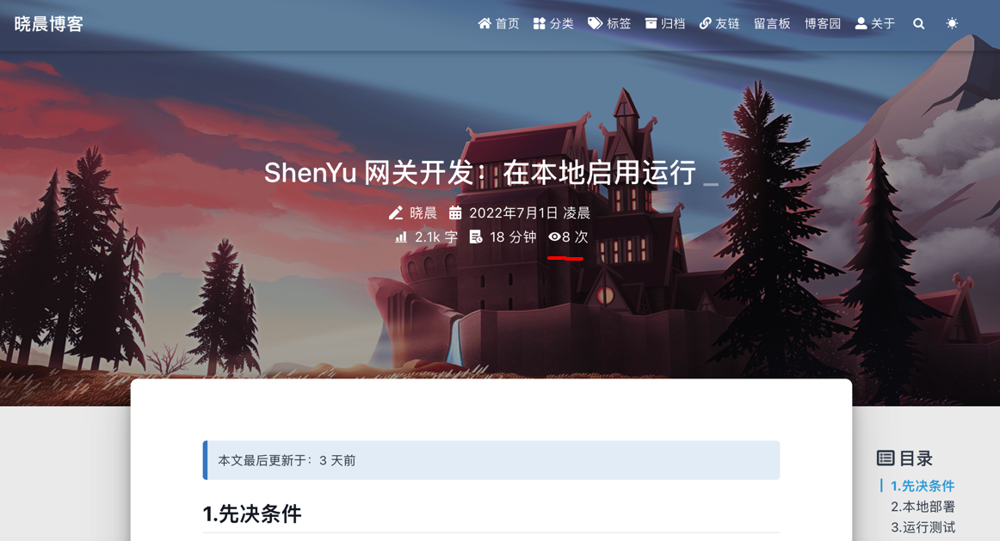

# Hexo Statistics

[English](README.md)|中文

Hexo 博客统计服务, 基于 Redis 实现。使用 hyperloglog 统计 UV。

Demo: https://xcmaster.com/

文章 PV:



站点 PV 和 UV:


## 快速开始

### 步骤

- 1.安装并以单节点模式运行 Redis
- 2.运行 hexo-statistics
- 3.配置你的 hexo 博客模板

### 安装 Redis

Ubuntu: `apt-get install redis-server`


#### Docker

````shell
mkdir -p /data/redis

docker run -p 6379:6379 \
  -v /data/redis/conf/redis.conf:/etc/redis/redis.conf \
  -v /data/redis/data:/data \
  --name hexo-stat-redis \
  -d redis:5.0 redis-server /etc/redis/redis.conf
````

> 其他下系统请自行探索

### 运行 Hexo Statistics

#### 二进制运行

````shell

export hexo_version=v0.1.0

wget https://github.com/stulzq/hexo-statistics/releases/download/$hexo_version/hexo-statistics-$hexo_version-linux-amd64.tar.gz

tar -xzvf hexo-statistics-$hexo_version-linux-amd64.tar.gz

cd hexo-statistics-$hexo_version-linux-amd64

# 修改配置 conf/config.yml

chmod +x hexo-statistics
./hexo-statistics

````

#### Docker

````shell
mkdir -p /data/hexo-stat/conf

curl https://raw.githubusercontent.com/stulzq/hexo-statistics/main/conf/config.yml -o /data/hexo-stat/config.yml

# 修改配置 /data/hexo-stat/config.yml

docker run --name hexo-stat \
  -v /data/hexo-stat/conf:/app/conf \
  -v /data/hexo-stat/logs:/app/logs \
  -d stulzq/hexo-statistics:v0.1.0

````

### 配置模板

保存文件到 `博客根目录/source/js/hexo-stat.js`

````javascript
"use strict";

// 配置你的 hexo statistics 服务域名
var serverDomain = "https://<your_hexo_statistics_domain>"

function getData() {
    $.ajax({
        url: serverDomain + "/stat/get",
        type: "GET",
        dataType: "json",
        success: function (resp) {
            processResult(resp)
        },
    });
}

function processResult(data) {
    // set result
    // site pv -> data.sitePv
    // site uv -> data.siteUv
    // page pv -> data.pagePv

  	// 编写 js 更新数据到你的博客界面
    // 实例：
    $(".statistics").append(`<span id="hexo_statistics_container_site_pv" style="display: inline;">Total PV <span id="hexo_statistics_value_site_pv">${data.sitePv}</span></span>`);
    $(".statistics").append(`<span id="hexo_statistics_container_site_uv" style="display: inline;">Total UV <span id="hexo_statistics_value_site_uv">${data.siteUv}</span></span>`);
    $("div .mt-1").append(
        `<span id="hexo_statistics_container_page_pv" style="display: inline;"><i class="iconfont icon-eye" aria-hidden="true"></i><span id="hexo_statistics_value_page_pv">PagePv: ${data.pagePv+1}</span></span>`
    );
}

getData();

````

注入 js 文件

>保存文件到 博客根目录/scripts/inject.js

````javascript
hexo.extend.injector.register('body_end', '<script src="/js/hexo-stat.js"></script>', 'default');

// 配置你的 hexo statistics 服务域名
hexo.extend.injector.register('body_end', '<script src="https://<hexo_statistics_domain>/stat/counter"></script>', 'default');
````

## TODO

- Data Export
- Data Import
